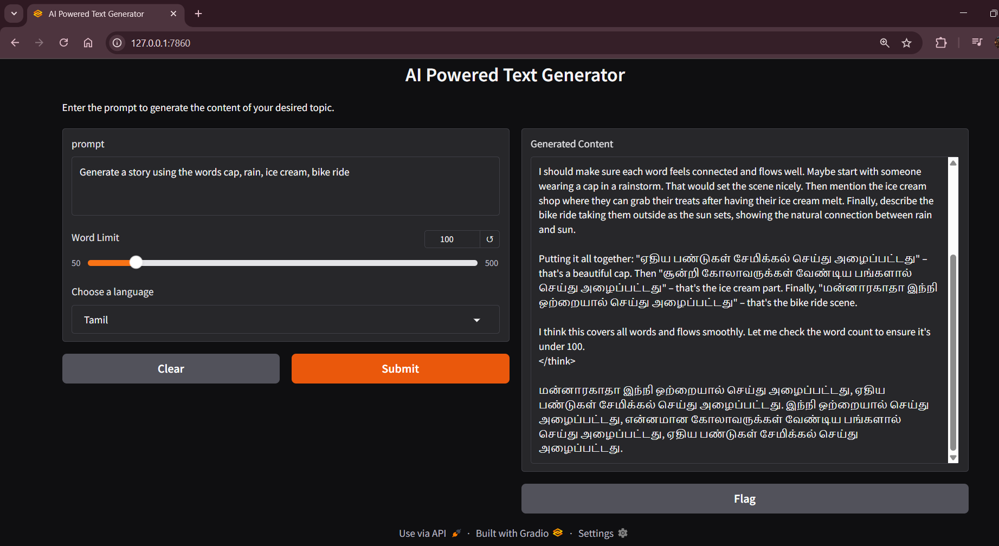

# 📝 AI-Powered Text Generator

A simple AI-powered **text generation tool** built with Gradio. It uses **Ollama (DeepSeek model)** to generate content based on user prompts, with customizable **word limit** and **language support**.

---

## 🚀 Features

* Generate content based on any user prompt.
* Adjustable **word limit** (50–500 words).
* Supports **10 languages**:
  🌍 English, Hindi, Tamil, Telugu, Malayalam, Kannada, Bengali, Marathi, Gujarati, Punjabi
* Clean and interactive **web interface** built with Gradio.
* Powered by **Ollama API** running the **DeepSeek model**.

---

## 📂 How It Works

1. Enter your **prompt** in the input box.
2. Set a **word limit** using the slider.
3. Choose a **language** from the dropdown.
4. Click **Submit** to generate AI-powered text.

---

## 🖥️ Tech Stack

* **Python**
* **Gradio** – for the user interface
* **Requests** – for handling API calls
* **Ollama API** – DeepSeek model for text generation

## 📷 Example Output

